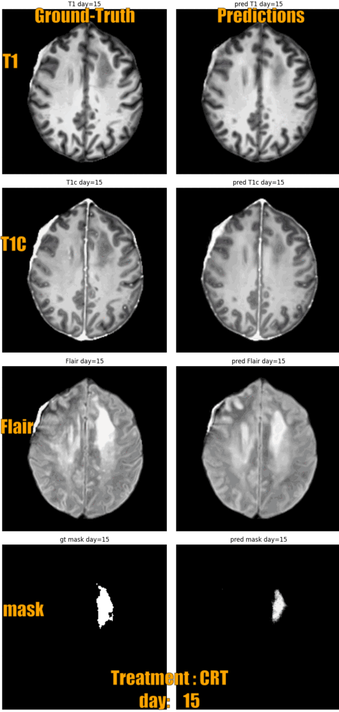
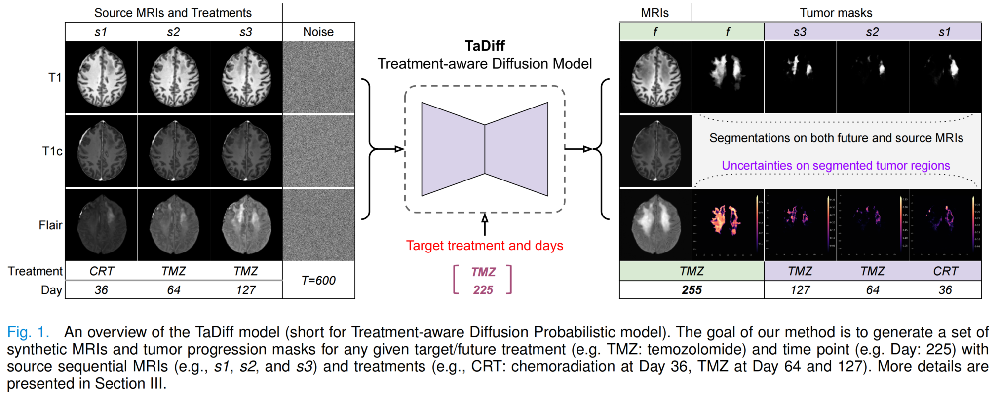

# TaDiff-Net

[](https://doi.org/10.1109/TMI.2025.3533038)

This repository implements TaDiff-Net, a treatment-aware diffusion probabilistic model for longitudinal MRI generation and diffuse glioma growth prediction. The model generates future predictions of tumor masks and multi-parametric MRI images for different treatment plans.

<div style="display: flex; align-items: unsafe center;">
    
    
</div>

## 📚 Overview

TaDiff-Net is a novel end-to-end network that:
- Generates future predictions of tumor masks and multi-parametric MRI images
- Supports different treatment plans
- Uses diffusion probabilistic models and deep-segmentation neural networks
- Incorporates sequential multi-parametric MRI and treatment information
- Provides uncertainty estimates for clinical decision-making

The model was trained on real-world postoperative longitudinal MRI data from glioma patients.

## 📁 Project Structure

```
TaDiff-Net/
├── config/                 # Configuration files
│   └── test_config.py      # Model and test settings
├── src/                   # Source code
│   ├── data/              # Data handling
│   │   └── data_loader.py # Data loading and preprocessing
│   ├── evaluation/        # Evaluation metrics
│   │   ├── metrics.py     # Evaluation metrics
│   │   └── ssim.py        # SSIM implementation
│   ├── net/               # Model implementations
│   │   └── diffusion.py   # Diffusion model
│   ├── visualization/     # Visualization tools
│   │   └── visualizer.py  # Visualization utilities
│   └── tadiff_model.py    # Main model implementation
├── ckpt/                  # Model checkpoints
├── data/                  # Data directory
├── test.py                # Testing script
├── inference.py           # Inference script
└── README.md              # Documentation
```

## 🛠️ Setup

1. Clone the repository:
```bash
git clone https://github.com/samleoqh/TaDiff-Net.git
cd TaDiff-Net
```

2. Install dependencies:
```bash
pip install -r requirements.txt
```

3. Prepare your data:
   - Place your data files in the `data/` directory
   - Data should be organized as follows:
     ```
     data/
     ├── {patient_id}_image.npy    # Image data (T1, T1c, FLAIR)
     ├── {patient_id}_label.npy    # Ground truth labels (for testing)
     ├── {patient_id}_days.npy     # Time points
     └── {patient_id}_treatment.npy # Treatment information
     ```

## 🚀 Usage

### Testing

To evaluate the model with ground truth data:

```bash
python test.py --patient_ids 17 --diffusion_steps 500 --num_samples 5
```

This will:
1. Load the model and test data
2. Generate predictions for each patient and slice
3. Calculate evaluation metrics
4. Save results and visualizations

Output will be saved in the configured save path with:
- Evaluation metrics in CSV format
- Prediction visualizations
- Uncertainty maps
- Ground truth comparisons

### Inference

To generate predictions without ground truth:

```bash
python inference.py --patient_ids 17 --diffusion_steps 50 --input_day 20 --input_treatment 1
```

This will:
1. Load the model and input data
2. Generate predictions for target patient and slice
3. Save ensemble predictions and plot uncertainty maps

## 📊 Evaluation Metrics

The model is evaluated using:
- Dice coefficient (at multiple thresholds)
- Mean Absolute Error (MAE)
- Peak Signal-to-Noise Ratio (PSNR)
- Structural Similarity Index (SSIM)
- Relative Absolute Volume Difference (RAVD)

## 🎨 Visualization

The visualization module provides:
- Prediction overlays
- Uncertainty maps
- Contour visualization
- Multi-modal image display

## 📖 Citation

If you find this code helpful in your work, please cite:

```
@ARTICLE{10851394,
  author={Liu, Qinghui and Fuster-Garcia, Elies and Thokle Hovden, Ivar and MacIntosh, Bradley J. and Grødem, Edvard O. S. and Brandal, Petter and Lopez-Mateu, Carles and Sederevičius, Donatas and Skogen, Karoline and Schellhorn, Till and Bjørnerud, Atle and Eeg Emblem, Kyrre},
  journal={IEEE Transactions on Medical Imaging}, 
  title={Treatment-Aware Diffusion Probabilistic Model for Longitudinal MRI Generation and Diffuse Glioma Growth Prediction}, 
  year={2025},
  volume={44},
  number={6},
  pages={2449-2462},
  doi={10.1109/TMI.2025.3533038}}
```
